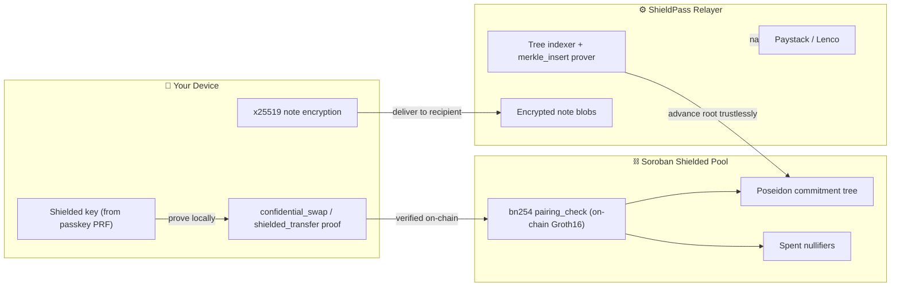

<p align="center">
  
</p>

# 🛡️ Shieldpass-lite

### Ultimate Privacy: Trustless Crypto → Fiat Off-Ramp + Private Payments on Stellar

Shieldpass-lite is a private cross-border remittance corridor, forked from the original ShieldPass with a simplified flow: **every deposit shields automatically** (no manual Shield step), and sending decides for itself whether to stay private or go public based on the recipient. It lets anyone swap crypto for Nigerian naira **instantly**, paid straight to their bank account — **without ever exposing their identity or banking data on-chain** — and send funds **privately to other users**, where the amount, sender, and receiver stay hidden.

> Shieldpass-lite deploys its **own** Shielded Pool contracts and relayer wallet — it never shares on-chain state with the original ShieldPass app. Each backend keeps its own off-chain mirror of the pool's merkle tree, so two independent deployments writing to the same contract would silently diverge.

Your crypto lives in a **Shielded Pool**, not a standard escrow. You prove ownership and compliance with **zero-knowledge proofs** generated locally on your device, and the **smart contract verifies every proof on-chain** using Stellar's native BN254 pairing functions. The chain only ever sees mathematics — never your BVN, name, or bank details.

> **Built for the _Stellar Hacks: ZK_ hackathon.** The ZK proof is *load-bearing*: no valid proof ⇒ no swap, no transfer, no payout. Verification happens **on Soroban itself**, not off-chain.

<p align="center">
  <code>Shielded Pool</code> • <code>On-chain Groth16 (BN254)</code> • <code>Private P2P Transfers</code> • <code>Multi-Asset (XLM + USDC)</code> • <code>Zero-Storage Backend</code> • <code>Passkey Smart Wallets</code> • <code>Gasless</code>
</p>

https://github.com/user-attachments/assets/c7becb28-e9a1-4f93-8495-d6640cc946c3

---

## 🧭 The Ultimate Privacy Architecture (Old vs New Way)

Traditional off-ramps force you to upload your identity, trust a custodian with your funds, and publicly broadcast your transactions. ShieldPass eliminates all three — and adds **fully private peer-to-peer payments** on top.

### 1. The Shielded Pool (The "Dark Pool")
<p align="center"></p>

* **Old Way:** When you sent money, everyone could see it sitting in an escrow account.
* **New Way:** All user funds of a given asset are mixed in one pool. Each balance is a secret **note** (`Poseidon(amount, owner, randomness, …)`) owned by your shielded key. Nobody scanning the chain can tell which note is yours. ShieldPass currently runs **two live pools — XLM and USDC** — each a separate contract instance (same audited wasm/circuits, bound to a different token at `init`).

### 2. On-Chain ZK Verification (No Trusted Verifier)
* **Old Way:** Proofs were checked off-chain by a backend you had to trust.
* **New Way:** The Soroban contract verifies every Groth16 proof **itself**, on-chain, via the native `bn254` pairing-check host function (~37.5M instructions — well within budget). The math is the only authority.

### 3. Trustless Append-Only Tree (No Trusted Root)
* **Old Way:** The pool would have to trust a relayer to publish the correct Merkle root.
* **New Way:** A dedicated **`merkle_insert`** ZK circuit proves every `old_root → new_root` transition. The contract verifies each append, so the commitment tree advances **trustlessly** — no party can forge a root.

### 4. Private Payments (Hidden Amounts)
* **Old Way:** Sending money revealed who, to whom, and how much.
* **New Way:** A **`shielded_transfer`** proof spends your note and mints one note for the recipient + a change note for you — **entirely inside the pool**. The amount, sender, and receiver are all hidden; only the recipient learns the amount (from an encrypted blob).

### 5. Zero-Storage Banking (Hack-Proof Database)
<p align="center"></p>

* **Old Way:** We saved your bank account in our database. A breach leaked your banking info.
* **New Way:** We don't save your bank account *at all*. It lives in your browser; at swap time your phone flashes the details to the backend, we pay the bank, and the details are dropped from memory.

### 6. Trustless Refunds (Math-Enforced Escape Hatch)
<p align="center"></p>

* **Old Way:** If the off-ramp took your crypto but never paid the fiat, your funds were gone.
* **New Way:** A withdrawal pre-commits a **refund note** on-chain. If the naira never settles, after a 1-hour time-lock you reclaim your value trustlessly — the platform can never simply keep the crypto. *(A future zkTLS `fiat_payout` proof will make the claim itself fully trustless; today the claim is admin-gated and the refund is your guarantee.)*

---

## 🔄 How the App Works (Step-by-Step)

Meet **Tobi**, who wants to use Shieldpass-lite:

**1. Onboard (invisible funding).** Tobi signs up with Google (Firebase Auth) or a manually-typed email, then secures the account with a Passkey (Face ID). His **shielded identity** (spending + encryption keys) is derived from the passkey itself. Shieldpass-lite mints him a secret **note** worth 100 XLM — no public transaction happens. To the outside world, his wallet holds $0.

**2. Auto-shield.** There's no manual "Shield" button — any XLM/USDC that lands in Tobi's public wallet is detected and shielded automatically (one passkey confirmation per deposit). Nothing sits in the open for long.

**3. Withdraw to Naira.** Tobi cashes out 100 XLM. On his phone a ZK proof spends his note, mints a 400 XLM change note, and authorizes the contract. The backend pays his bank via Paystack/Lenco; the change stays private.

**4. Send — private or public, decided automatically.** Tobi sends 50 XLM to a friend by **email or `shp_` address** — a `shielded_transfer` proof moves the value inside the pool, **fully private**. His friend's app scans, decrypts the note, and their shielded balance just goes up. Sending to a raw `G…`/`C…` wallet address instead unshields it on arrival — the Send tab picks whichever the recipient string implies, with no separate toggle. A 🔔 notification fires either way.

**5. Stay informed.** Every action — faucet, auto-shield, withdraw, send, and **received payments** — lands in an in-app **Activity feed** with an unread badge.

---

## 🔐 Cryptographic Pipeline

Three Circom/Groth16 circuits over BN254, all **verified on-chain**:

1. **`confidential_swap` (browser):** proves you own a valid note, derives the spend `nullifier`, and computes the change. Used by **Withdraw** and **Unshield**. `swap_amount` is public here (real value leaves the pool).
2. **`shielded_transfer` (browser):** spends one note → **two** output notes (recipient + change). **Amounts are private**; the recipient's owner tag is bound into the proof. Powers **private P2P payments**.
3. **`merkle_insert` (backend):** proves each `old_root → new_root` tree append so the pool's commitment tree advances **trustlessly** — no on-chain hashing needed.



---

## 🤝 Private Payments (How It Stays Private)

Sending to another ShieldPass user keeps everything hidden, like a locked mailbox with no names:

1. You encrypt the note details to the recipient's published **encryption key** (x25519 ECDH + XChaCha20-Poly1305) and submit the `shielded_transfer`.
2. The funds **never leave the pool** — your note is nullified; the recipient gets a new note; nothing public is revealed.
3. The recipient's app **scans** new encrypted blobs, trial-decrypts with their key, finds the ones meant for them, and updates their shielded balance — automatically, with a notification.

> Sending to an external `G…`/`C…` wallet instead **unshields** (the funds become public on arrival). Sending to a ShieldPass user stays **fully shielded**.

---

## 🪜 Progressive KYC — Programmable Privacy

A **tiered** compliance model so small swaps stay frictionless while large ones stay regulated:

| Tier | Gate | Unlocks |
|---|---|---|
| **Tier 1** | Passkey **hardware attestation** (`hardware_attested`) | Everyday swaps |
| **Tier 2** | **BVN** verification (`bvn_verified`) | High-value swaps (> ₦1,000,000) |

The *same* circuit enforces both. A public input `require_bvn` is set by the backend from the swap's naira value; the contract rejects a high-value withdrawal that didn't use a Tier-2 proof. Compliance attributes are bound **into the note**.

---

## 🔑 Passkey Smart Wallets + Shielded Identity

No seed phrases, no extensions, no XLM required. Each user gets an **OpenZeppelin Smart Account** secured by a WebAuthn passkey; transactions are submitted **gaslessly** via the relayer. Your **shielded key** (which owns your private notes) is derived from the **passkey's PRF** — so resetting your login PIN never touches your private funds.

---

## 🛠️ Tech Stack

| Layer | Tech |
|---|---|
| **ZK Circuits** | **Circom** + **snarkjs** Groth16, Poseidon (BN254) |
| **On-chain verification** | Soroban native `bn254` pairing-check (Rust contract) |
| **Smart Contract** | Rust / Soroban — Shielded Pool (deposit · insert · confidential_swap · unshield · shielded_transfer · claim · refund), one instance per supported asset |
| **Note encryption** | x25519 + XChaCha20-Poly1305 (`@noble`) |
| **Wallets** | OpenZeppelin **Smart Accounts** (WebAuthn passkeys / secp256r1) |
| **Gasless Relay** | OpenZeppelin Channels |
| **Backend** | Node, Express, Prisma 7 + Neon Postgres |
| **Frontend** | React, Vite, Tailwind, Framer Motion |
| **Fiat Payouts** | Paystack + Lenco (stateless / zero-storage) |

---

## 📡 Deployment

* **Network:** Stellar / Soroban **testnet**
* **XLM Shielded Pool:** [`CANMADBDELNOAPKPNXOYB2TVRYCY4CR4LWIYVCYR6WSVMKOUK3SQJIMT`](https://stellar.expert/explorer/testnet/contract/CANMADBDELNOAPKPNXOYB2TVRYCY4CR4LWIYVCYR6WSVMKOUK3SQJIMT) — token: native XLM SAC
* **USDC Shielded Pool:** [`CCOCHYWMEWYQ53UFHWIACXLSFIUOD73SXL7FQ3GIAVDS7R6IV5LT6WPA`](https://stellar.expert/explorer/testnet/contract/CCOCHYWMEWYQ53UFHWIACXLSFIUOD73SXL7FQ3GIAVDS7R6IV5LT6WPA) — token: testnet USDC SAC
* **Wallets:** OpenZeppelin smart-account-kit, shared pre-deployed account wasm + WebAuthn verifier on testnet (gasless submission via OpenZeppelin Channels)

> These are Shieldpass-lite's own contracts and relayer wallet — deployed and funded independently of the original ShieldPass app's pools (see the warning at the top of this README for why they can never be shared).

---

## 🚀 Local Development

**Prerequisites:** Node 20+ (Prisma 7 requires ≥ 20.19), Rust + `stellar` CLI (for the contract), `circom` (only to regenerate circuits), a backend `.env`, and a frontend `.env`.

```bash
# Backend — prisma generate is required (the v7 client is gitignored)
cd backend && npm install && npx prisma generate && npm run dev   # http://localhost:3001

# Frontend
cd frontend && npm install && npm run dev                          # http://localhost:5173
```

**Running backend tests:** the test suite hits a real (migrated) Postgres — there's no mock/in-memory
DB. Before the first `npm test`, push the schema once:

```bash
cd backend && npm run db:setup   # prisma generate + prisma db push against NEON_CONNECTION_STRING
npm test
```

Build & test the Soroban Shielded Pool:

```bash
cd SDK/contracts/shielded_pool && cargo test           # contract tests (real proofs)
stellar contract build                                  # wasm for deploy
```

Regenerate circuits + proving keys (only if you change a circuit):

```bash
cd SDK/circom && npm install
bash scripts/build.sh confidential_swap
bash scripts/build.sh merkle_insert
bash scripts/build.sh shielded_transfer
```

Key environment variables:

| File | Var | Purpose |
|---|---|---|
| `backend/.env` | `NEON_CONNECTION_STRING` | Neon Postgres direct URL (`?sslmode=require`, no `channel_binding`) |
| `backend/.env` | `STELLAR_CONTRACT_ID` / `USDC_POOL_CONTRACT_ID` | XLM / USDC Shielded Pool contract ids |
| `backend/.env` | `XLM_SAC_ADDRESS` / `USDC_SAC_ADDRESS` | Stellar Asset Contract addresses backing each pool |
| `backend/.env` | `STELLAR_RELAYER_SECRET` | Admin/relayer keypair (pool init, faucet seeding) |
| `backend/.env` | `CHANNELS_URL` / `CHANNELS_API_KEY` | OpenZeppelin Channels — required for gasless smart-account submission |
| `backend/.env` | `CORS_ORIGIN` | Comma-separated allowed frontend origin(s); unset = allow all (dev only) |
| `backend/.env` | `PAYSTACK_SECRET_KEY` / `LENCO_*` | Naira payout providers |
| `backend/.env` | `FAUCET_NOTE_AMOUNT` / `FAUCET_NOTE_ASSET` | Onboarding seed note (defaults `100` / `XLM`) |
| `backend/.env` | `SEED_TOKENS` | Fallback public-funding for brand-new smart wallets (comma-separated `contractId:amount`) |
| `backend/.env` | `FIREBASE_PROJECT_ID` / `FIREBASE_CLIENT_EMAIL` / `FIREBASE_PRIVATE_KEY` | Service account credentials, verifies the Firebase (Google) login idToken — `FIREBASE_PROJECT_ID` must match the frontend's `VITE_FIREBASE_PROJECT_ID` |
| `frontend/.env` | `VITE_API_URL` | Backend URL (powers swaps, transfers, scanning, notifications) |
| `frontend/.env` | `VITE_FIREBASE_API_KEY` / `VITE_FIREBASE_AUTH_DOMAIN` / `VITE_FIREBASE_PROJECT_ID` / `VITE_FIREBASE_APP_ID` | Web app config from the [Firebase console](https://console.firebase.google.com) — the "Continue with Google" button throws until these are set |
| `frontend/.env` | `VITE_ACCOUNT_WASM_HASH` / `VITE_WEBAUTHN_VERIFIER_ADDRESS` | smart-account-kit account wasm + WebAuthn verifier contract |
| `frontend/.env` | `VITE_XLM_POOL_CONTRACT_ID` / `VITE_USDC_POOL_CONTRACT_ID` | Per-asset Shielded Pool contract ids |
| `frontend/.env` | `VITE_XLM_SAC` / `VITE_USDC_SAC` | Per-asset SAC addresses (drives which assets show up in the UI) |

---

## ✅ Going live checklist (Render + Vercel)

`render.yaml` and `vercel.json` handle the build/deploy mechanics, but a few values are
deliberately `sync: false` (kept out of the repo) and must be set by hand in each dashboard
before a real deploy will actually work:

- [ ] **Firebase project** — create one at [console.firebase.google.com](https://console.firebase.google.com),
      enable the Google sign-in provider, set the `VITE_FIREBASE_*` vars in Vercel from the Web
      app config, and the `FIREBASE_*` vars in Render from a generated service account key.
- [ ] **Render dashboard secrets** — `NEON_CONNECTION_STRING`, `STELLAR_CONTRACT_ID`,
      `STELLAR_RELAYER_SECRET`, `CORS_ORIGIN`, `CHANNELS_API_KEY`, `PAYSTACK_SECRET_KEY`. The two
      Stellar values must be Shieldpass-lite's **own** pool/relayer, never copied from another
      deployment of this codebase.
- [ ] **Vercel env vars** — `VITE_API_URL` (pointing at the Render backend), plus the contract/SAC
      vars from the table above.
- [ ] **CORS_ORIGIN** — once the Vercel URL is known, set it on the Render service so the API
      isn't wide open to any origin.

---

## 📜 License

See [LICENSE](./LICENSE).
